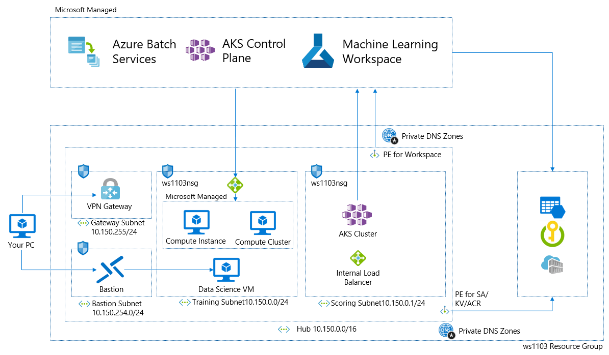
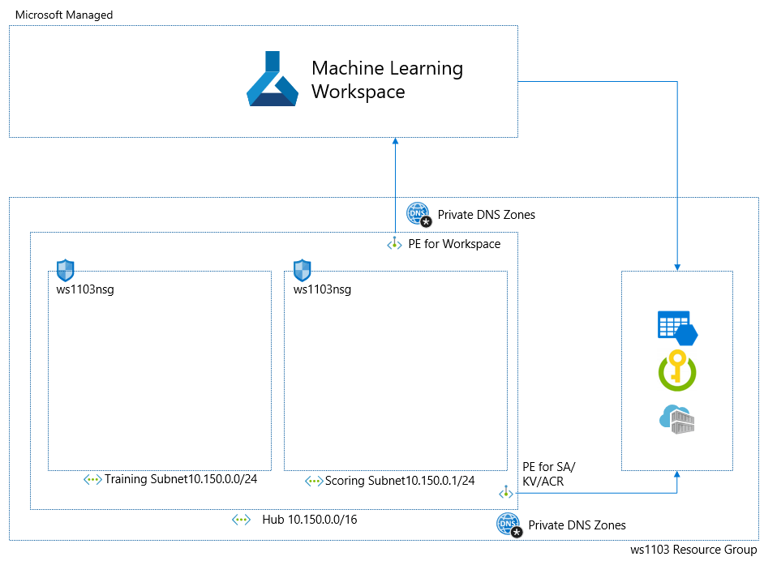
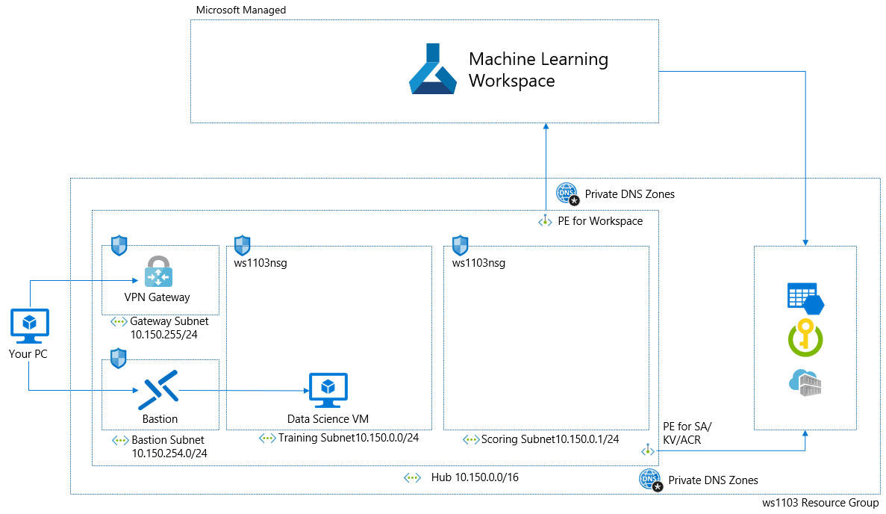
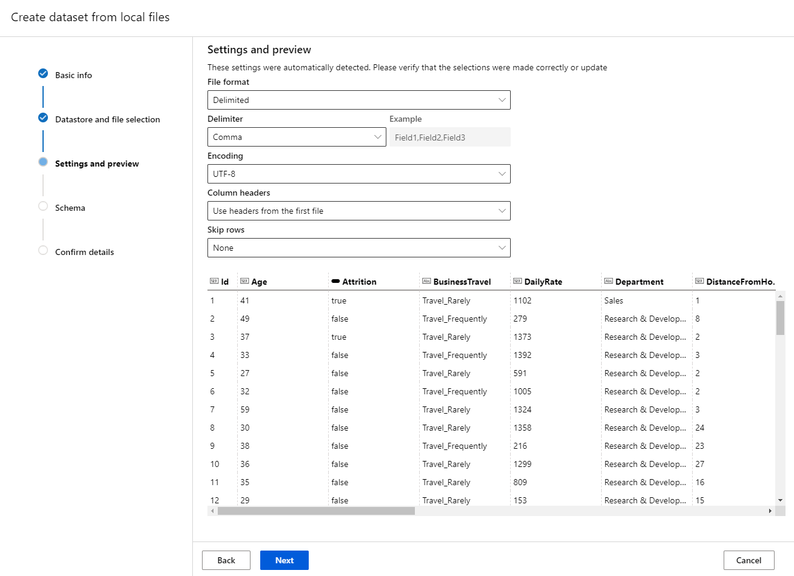
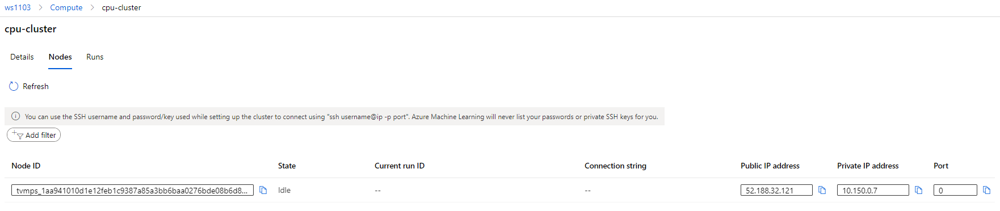
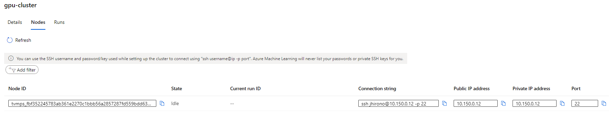
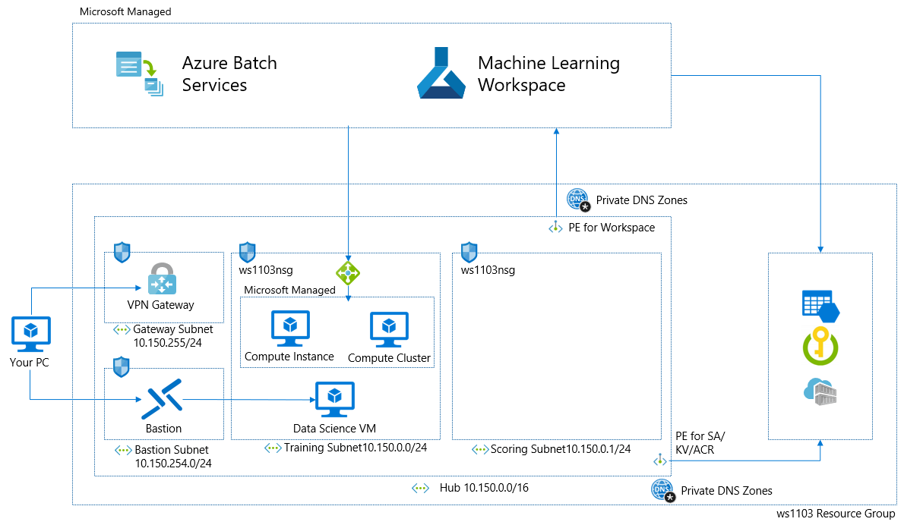
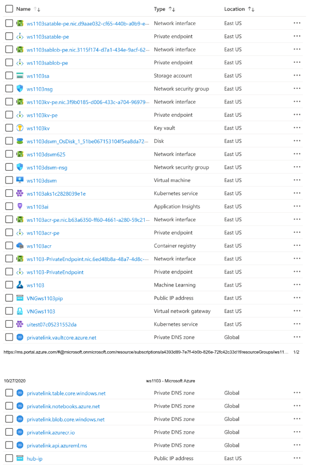

# Welcome to step-by-step guide to provision secure workspace

You can learn how to create secure machine learning platform using Azure and Azure Machine Learning. Sorry!! For now this document has only CLI commands and your contribution to add powershell commands is appreciated.

## 0. Requirements

* Azure Subscription
* Submit a support request for private endpoint allowance. Details in [here](https://docs.microsoft.com/azure/machine-learning/how-to-manage-quotas#private-endpoint-and-private-dns-quota-increases) and we use three scenarios: private link and Customer managed key enabled workspace, ACR behind VNet and Private AKS Cluster.
* Your favorite terminal to use Azure cli
* Latest version of Azure cli: sudo apt-get update && sudo apt-get install --only-upgrade -y azurecli
* Latest version of Azure cli-ml: az extension update -n azure-cli-ml
* If you are not familiar with AML Security, please read this [doc](https://docs.microsoft.com/azure/machine-learning/how-to-network-security-overview).

## 0. What you will create



* Private Link and Customer Managed Key enabled workspace
* VPN connection to private link enabled workspace
* Secure associated resources (Storage, KeyVault, ACR)
* Custom Roles for IT Admin, Data Scientist and Power Data Scientist
* Secure model training environment
* Secure model scoring environment

## 1. Provision Secure workspace

You will create followings.

* Resource Group
* VNet and Subnets
* Private Link enabled workspace
* Storage with private endpoint
* ACR with private endpoint
* KV with private endpoint

Architecture is like below.



### Create Resource Group

```azurecli-interactive
az group create -n ws1103 -l eastus
```

### Create VNet and Subnets

You put workspace and training compute resources such as compute cluster, compute instance in training subnet. You also put AKS cluster in the scoring subnet because AKS consumes many IPs.

* VNet: hub / 10.150.0.0/16
* Subnet: training / 10.150.0.0/24
* Subnet: scoring / 10.150.1.0/24
* Network Security Group for both subnets

Create VNet and Subnets
```azurecli
az network VNet create -g ws1103 -n hub --address-prefix 10.150.0.0/16 --subnet-name training --subnet-prefix 10.150.0.0/24
az network VNet subnet update -g ws1103 --VNet-name hub -n training --service-endpoints Microsoft.Storage Microsoft.KeyVault Microsoft.ContainerRegistry
az network VNet subnet create -g ws1103 --VNet-name hub -n scoring --address-prefixes 10.150.1.0/24
az network VNet subnet update -g ws1103 --VNet-name hub -n scoring --service-endpoints Microsoft.Storage Microsoft.KeyVault Microsoft.ContainerRegistry
```

Create NSG and attach to subnets. NSG rule will be updated later.
```aazurecli
az network nsg create -n ws1103nsg -g ws1103 
az network vnet subnet update -g ws1103 --vnet-name hub -n training --network-security-group ws1103nsg
az network vnet subnet update -g ws1103 --vnet-name hub -n scoring --network-security-group ws1103nsg
```

### Create KeyVault for encryption

You will create workspace encrypted by your key and you need keyvault and key for that. If you are fine with the encryption using Microsoft Managed Key which is default, you can skip this section. You will create followings.

* KeyVault
* Key for Workspace Encryption
* KeyVault private endpoint for hub VNet

KeyVault and Key Creation
```azurecli
az keyvault create -l eastus -n ws1103kv -g ws1103
az keyvault key create -n ws1103key --vault-name ws1103kv
```

> **BEFORE YOU CONTINUE** I recommend taking note of below information for workspace encryption parameters. Note that below is my example and you will have different ones.

* Resource ID: /subscriptions/a4393d89-7e7f-4b0b-826e-72fc42c33d1f/resourceGroups/ws1103/providers/Microsoft.KeyVault/vaults/ws1103kv
* KID: https://ws1103kv.vault.azure.net/keys/ws1103key/5cb33f32dbbb468eb71c6ee0de1b5e84

Create Private Endpoint for hub VNet
* Please look [this doc](https://docs.microsoft.com/azure/key-vault/general/private-link-service).

### Provision Private Link and Customer Managed Key Enabled Workspace

You will create followings in your resource group.

* workspace and associated resources (Storage, KeyVault, ACR, AppInsights)
* Private Endpoint and NIC
* Two Private DNS Zones (One for Workspace, One for Integrated Notebook)

In a newly created resource group, you will create

* CosmosDB and Storage to store your metadata
* Azure Search
* VNet

I recommend using [this quick start template](https://github.com/Azure/azure-quickstart-templates/tree/master/201-machine-learning-advanced) and read [this how-to-use-ARM-template doc](https://docs.microsoft.com/azure/machine-learning/how-to-create-workspace-template). You can also create private link/CMK workspace from portal.azure.com. You can find my parameter file in [here](./Template/azuredeploy.parameters.json) as an example. Below are key parameters.

* StorageAccount/KeyVault/ACR/VNet/Subnet Option: new or existing to use your existing resources
* StorageAccount/KeyVault/ACR BehindVNet: true or false
* ContainerRegistrySKU: Premium is required for behind VNet
* Confidential data: You can limit the amount of data gathered by Microsoft for diagnosis. Details in [here](https://docs.microsoft.com/azure/machine-learning/concept-enterprise-security#encryption-at-rest)
* Cmk_keyvault: keyvault's resource id for cmk encryption
* Resource_cmk_uri: key's resource id for cmk encryption
* PrivateEndpointType: AutoApproval/ManualApproval for private endpoint creation

Please note that you can create private endpoint for existing workspace from portal.azure.com or ARM template.

```azurecli
az deployment group create -n plcmkworkspace1103 -g ws1103 -f azuredeploy.json -p azuredeploy.parameters.json
```

### Create Private Endpoints for Storage, KeyVault, ACR

I recommend using UX to create private endpoint because 10-ish CLI inputs are required. If you want to do in CLI, please see this doc for [storage](https://docs.microsoft.com/azure/private-link/create-private-endpoint-cli), [keyvault](https://docs.microsoft.com/azure/key-vault/general/private-link-service), [ACR](https://docs.microsoft.com/azure/container-registry/container-registry-private-link).

Note that private endpoint is linked with VNet through private DNS zones. You need one private endpoint per VNet per resource. You need to create followings.

* Private Endpoint for Storage Blob
* Private Endpoint for Storage File
* Private Endpoint for Azure Container Registry
* Private Endpoint for Azure KeyVault

I show architecture again and please confirm your settings.


## 2. Establish the access to private link enabled workspace

Your private link enabled workspace can be accessed only through private endpoint created for your workspace over private IP of your VNet. In order to access your workspace, I explain two ways.

> **WARNING** If you see below error, most likely you are accessing private link enabled workspace using public IP. This is because your DNS configuration is not correct or you are accessing workspace from outside VNet.
> **REQUEST_SEND_ERROR**: Your request for data wasn’t sent. Here are some things to try: Check your network and internet connection, make sure a proxy server is not blocking your connection, follow our guidelines if you’re using a private link, and check if you have AdBlock turned on.

1. Establish Point to Site VPN connection to your workspace hub VNet and update hostfile
1. Create VM in your workspace hub VNet as a jumpbox VM

### Establish point to site VPN connection (advanced)

You will create followings. Please see [this step by step guide](https://docs.microsoft.com/azure/vpn-gateway/vpn-gateway-howto-point-to-site-resource-manager-portal).

* Virtual network gateway
* Gateway subnet for Virtual network gateway
* NSG for Gateway subnet
* Public IP addresses for Virtual network gateway

You also need to update your hostfile to resolve workspace FQDNs with private IP. This is [the documentation for custom DNS](https://docs.microsoft.com/azure/machine-learning/how-to-custom-dns). Actual step and examples are below.

* Open hostfile (Win+R and %SystemRoot%\system32\drivers\etc\hosts)
* Below is my examples

```
## For workspace FQDNs
10.150.0.4 bf4ab0bd-2c9f-4480-abaf-f799f0832c80.workspace.eastus.api.azureml.ms
10.150.0.4 bf4ab0bd-2c9f-4480-abaf-f799f0832c80.studio.workspace.eastus.api.azureml.ms
10.150.0.4 bf4ab0bd-2c9f-4480-abaf-f799f0832c80.workspace.eastus.cert.api.azureml.ms
10.150.0.4 cert-bf4ab0bd-2c9f-4480-abaf-f799f0832c80.workspace.eastus.api.azureml.ms
10.150.0.4 bf4ab0bd-2c9f-4480-abaf-f799f0832c80.workspace.eastus.studioservice.azureml.com
10.150.0.4 bf4ab0bd-2c9f-4480-abaf-f799f0832c80.workspace.eastus.experiments.azureml.net
10.150.0.4 bf4ab0bd-2c9f-4480-abaf-f799f0832c80.workspace.eastus.modelmanagement.azureml.net
10.150.0.4 bf4ab0bd-2c9f-4480-abaf-f799f0832c80.workspace.eastus.aether.ms
10.150.0.5 ml-ws1103-eastus-bf4ab0bd-2c9f-4480-abaf-f799f0832c80.notebooks.azure.net

## For Associated Resources (Storage, KeyVault, ACR)
10.150.0.11 ws1103kv.vaultcore.azure.net
10.150.0.13ws1103acr.eastus.data.azurecr.io
10.150.0.14 ws1103acr.azurecr.io.
10.150.0.15 ws1103sa.blob.core.windows.net
10.150.0.7 ws1103sa.file.core.windows.net
```

Let's try to establish VPN connection to hub vnet and access ml.azure.com from your browser. If you do not see error, your configuration looks good.

> **BEFORE YOU CONTINUE** Enterprise corporation has custom DNS service. In that case, they need to configure their custom DNS to resolve FQDNs with Private IP.

### Create VM in your workspace hub VNet (easy)

You create Data Science Virtual Machine in training subnet. Look [this doc](https://docs.microsoft.com/azure/machine-learning/data-science-virtual-machine/provision-vm).

I recommend using Bation to access VM. Look [this doc](https://docs.microsoft.com/azure/bastion/create-host-cli)

Please also create NSG for Bastion subnet. Data Science VM is inside your VNet and you can access your private link enabled workspace. You have private DNS zones on Azure so you do not need hostfile update. If you do not see error, your configuration is succeeded.

Architecture looks below.


## 3. Enable ML Studio UX features

Services on ml.azure.com require the access right to your storage to access data. AML uses workspace managed identity for that. You need to access ml.azure.com, go to datastore and update default storage setting of "Click the Use workspace managed identity for data preview and profiling in Azure Machine Learning studio". See [this doc](https://docs.microsoft.com/azure/machine-learning/how-to-enable-studio-virtual-network).

Confirm data profiling works well with creating your dataset with your local CSV file. Please use [this file](https://www.kaggle.com/pavansubhasht/ibm-hr-analytics-attrition-dataset) for testing. If you see below screen, configuration is correct.



> **WARNING** If you encounter the error when you upload dataset to storage, you do not have the access to storage. If you encounter the error to do data profiling, managed identity configuration of storage has an issue.

You can also create dataset referencing data in Azure Blob, Azure File Share, Azure Data Lake, Azure Data Lake Gen 2, and Azure SQL DB. See [this doc](https://docs.microsoft.com/azure/machine-learning/how-to-access-data). We recommend Azure Data Lake Gen 2 for enterprises with requirement for file or directory level access control. Learn [access control lists (ACLs) in Azure Data Lake Gen2](https://docs.microsoft.com/azure/storage/blobs/data-lake-storage-access-control).

## 4. Manage Users and Roles

Role Based Access Control is essential for security. In this section you will create followings.

* Custom roles for IT Admin, Data Scientist, Data Scientist SUper User
* New account and grant Data Scientist role

You can find example custom roles in [here](./CustomRole/).

* IT Admin: Can do anything.
* Data Scientist Super User: Administrator of the workspace that can do all actions in the workspace including creating compute and adding assigning roles to users
* Data Scientist: Can create experiments, submit runs, deploy models to test environments; Cannot create compute

Custom Role Creation
```azurecli
az role definition create --role-definition data_scientist_role.json
```

Role assignment
```azurecli
az ml workspace share -w my_workspace -g my_resource_group --role "Data Scientist" --user xxx@contoson.com
```

> **WARNING** I use my gmail account as an example but "az ml workspace share" command does not work for federated account by Azure Active Directory B2B. Please use Azure UI portal instead of command.

## 5. Provision Secure training env (Compute Cluster, Compute Instance)

### Current Service Availability as of Oct 2020

| Service   |      Status      |
|----------|-------------|
| Compute Cluster behind VNet |  Fully supported |
| Compute Cluster with Private IP |    Private Preview but open to everyone in public regions, ARM template only   |
| Compute Instance behind VNet | Fully supported |
| Compute Instance with Private IP | Not Available/On Roadmap|

You will have followings.

* Compute Cluster behind VNet as CPU Cluster
* Compute Cluster with Private IP as GPU Cluster
* Compute Instance behind VNet
* Compute Instance behind VNet with on-be-half-of access

### Compute Cluster behind VNet

Compute cluster and Compute instance require inbound access from service tag BatchNodeManagement and AzureMachineLearning. At first let's allow those two service tags in inbound access in NSG.

```azurecli
az network nsg rule create -n batch --nsg-name ws1103nsg -g ws1103 --direction Inbound --priority 400 --source-address-prefixes BatchNodeManagement --source-port-ranges '*' --destination-port-ranges 29876-29877 --protocol Tcp --access Allow
az network nsg rule create -n aml --nsg-name ws1103nsg -g ws1103 --direction Inbound --priority 410 --source-address-prefixes AzureMachineLearning --source-port-ranges '*' --destination-port-ranges 44224 --protocol Tcp --access Allow
```

Then, create compute cluster behind VNet.

```azurecli
az ml computetarget create amlcompute -n cpu-cluster --min-nodes 1 --max-nodes 8 -s STANDARD_D3_V2 --vnet-name hub --vnet-resourcegroup-name ws1103 --subnet-name training --workspace-name ws1103 -g ws1103
```



Also look [this doc](https://docs.microsoft.com/azure/machine-learning/how-to-create-attach-compute-cluster).

> **WARNING** From UX, subnet is limited with workspace default VNet and subnet. Please use ARM template or CLI if you want to create it in different subnet under workspace default VNet. Please note that it should belong to the workspace VNet.

### Compute Cluster with Private IP

Currently creation using ARM template is only supported. Please use this [ARM template](./Template/deployplcompute.json). You can find my example [Parameter File](./Template/deployplcompute.parameters.json).

At first you need to disable private endpoint network policy. Details in [here](https://docs.microsoft.com/azure/private-link/disable-private-endpoint-network-policy).

```azurecli
az network vnet subnet update -g ws1103 --vnet-name hub -n training --disable-private-endpoint-network-policies true --disable-private-link-service-network-policies true
```

Then, create private IP enabled compute cluster.

```azurecli
az deployment group create -n privateipcomputecluster -g ws1103 -f deployplcompute.json -p deployplcompute.parameters.json
```

See the difference. This cluster has private IP only. In this case, Inbound Access from Batch Service Tag is not required.


### Compute Instance behind VNet

```azurecli
az ml computetarget create computeinstance -n ws1103ci1 -s "STANDARD_D3_V2" --vnet-name hub --vnet-resourcegroup-name ws1103 --subnet-name training --workspace-name ws1103 -g ws1103
```

Also look [this documentation](https://docs.microsoft.com/azure/machine-learning/how-to-create-manage-compute-instance).

> **WARNING** From UX, subnet is limited with workspace default VNet and subnet. Please use ARM template if you want to create it in different subnet under workspace default VNet. Please note that it should belong to the workspace VNet.

### Compute Instance behind VNet with on-be-half-of access

Basically IT admin wants to create compute instance for data scientist, but it was not supported. Now you can do that with [this template](./template/CIPoBoTemplate.json). My parameter file example is [here](./template/CIPoBOParameters.json).

```azurecli
az deployment group create -n cionbehalf -g ws1103 -f CIPoBoTemplate.json -p CIPoBoParameters.json
```

Confirm you cannot access Jupyter/RStudio on newly created compute instance. It can be accessed by data scientist. Now you have set up training resources. Architecture looks below.



> **BEFORE YOU GO** Some of you noticed that you cannot find Compute Instance and Compute Cluster in your resource group. They are managed by Microsoft but injected in your resource group and act like they exist in your VNet.

## 6. Provision Secure scoring env (AKS)

| Service   |      Status      |
|----------|-------------|
| AKS behind VNet |  Fully supported. You can create it on ml.studio.com, python SDK, CLI, ARM. |
| Private AKS Cluster |    Attach is supported. Please create private AKS cluster at first and attach to AML workspace.   |
| Load Balancer | Both public load balancer (default) and private load balancer are supported. |

> **WARNING** If you use public load balancer, you need to allow inbound access to Scoring IP on NSG. Read [this doc](https://docs.microsoft.com/azure/machine-learning/how-to-secure-inferencing-vnet#azure-kubernetes-service)

### AKS behind VNet with internal load balancer

Look [this doc](https://docs.microsoft.com/azure/machine-learning/how-to-secure-inferencing-vnet).

```azurecli
az ml computetarget create aks -n ws1103aks1 --load-balancer-type InternalLoadBalancer --load-balancer-subnet scoring -l eastus -g ws1103 --vnet-name hub --vnet-resourcegroup-name ws1103 --subnet-name scoring --workspace-name ws1103 --cluster-purpose DevTest --service-cidr 10.0.0.0/16 --dns-service-ip 10.0.0.10 --docker-bridge-cidr 172.17.0.1/16
```

### Private AKS Cluster with internal load balancer

Create Private AKS Cluster. [doc](https://docs.microsoft.com/azure/aks/private-clusters)

```azurecli
az aks create -g ws1103 -n ws1103privateaks --load-balancer-sku standard --enable-private-cluster --network-plugin azure --vnet-subnet-id /subscriptions/a4393d89-7e7f-4b0b-826e-72fc42c33d1f/resourceGroups/ws1103/providers/Microsoft.Network/virtualNetworks/hub/subnets/scoring --docker-bridge-address 172.17.0.1/16 --dns-service-ip 10.2.0.10 --service-cidr 10.2.0.0/24
```

Attach to workspace [doc](https://docs.microsoft.com/azure/machine-learning/how-to-create-attach-kubernetes)

```azurecli
az ml computetarget attach aks -n privateaks -i /subscriptions/a4393d89-7e7f-4b0b-826e-72fc42c33d1f/resourcegroups/ws1103/providers/Microsoft.ContainerService/managedClusters/ws1103privateaks -g ws1103 -w ws1103
```

For internal load balancer creation, you need to follow [this doc](https://docs.microsoft.com/azure/machine-learning/how-to-secure-inferencing-vnet#enable-private-load-balancer)

>**WARNING** Internal load balancer does not work with an AKS cluster that uses kubenet. If you want to use an internal load balancer and a private AKS cluster at the same time, configure your private AKS cluster with Azure Container Networking Interface (CNI).

Final architecture looks below.


Final resource group looks below.



## 7. Test machine learning job on secure AML platform

Now secure AML is ready to use. Let's open Integrated Notebook or Jupyter on Compute Instance and run the end-to-end data science job. I use [this example notebook](https://github.com/Azure/MachineLearningNotebooks/tree/master/tutorials/image-classification-mnist-data) for training and [this example notebook](https://github.com/Azure/MachineLearningNotebooks/tree/master/how-to-use-azureml/deployment/production-deploy-to-aks) for deployment to AKS.

> **WARNING** If you put ACR behind VNet, ACR cannot build image and you need to identify your compute cluster as the image build compute target. Look [this doc](https://docs.microsoft.com/azure/machine-learning/how-to-secure-workspace-vnet#enable-azure-container-registry-acr).

```python
from azureml.core import Workspace
# Load workspace from an existing config file
ws = Workspace.from_config()
# Update the workspace to use an existing compute cluster
ws.update(image_build_compute = 'mycomputecluster')
```

## 8. Additional Configurations & Considerations

### Custom DNS

If you use customer DNS, you need additional configurations to resolve workspace FQDNs. See [this doc](https://docs.microsoft.com/azure/machine-learning/how-to-custom-dns)

### Limit Outbound

You can limit outbound connectivity but you have two resources which require outbound access: Compute Cluster/Compute Instance and AKS.

* Compute Cluster/Instance need outbound traffic explained in [this doc](https://docs.microsoft.com/azure/machine-learning/how-to-secure-training-vnet#limiting-outbound-from-vnet). 
* AKS needs outbound traffic explained in [this doc](https://docs.microsoft.com/azure/aks/limit-egress-traffic).

However, for example, if you want to control outbound access to data science related OSS repositories, NSG is not flexible enough and you need to use firewall.

### Firewall

See [this doc](https://docs.microsoft.com/azure/machine-learning/how-to-access-azureml-behind-firewall).

### Managed Identity

You might have concern that AML requires admin key access to ACR and key access to Storage. We started preview of managed identity to get rid of two keys. See [this doc](https://docs.microsoft.com/azure/machine-learning/how-to-use-managed-identities).

### Azure Policy

We support CMK and Private Link related policy for AML. Policies for compute are on roadmap. See [this doc](https://docs.microsoft.com/azure/machine-learning/how-to-integrate-azure-policy).

## 9. Customer Feedback

### Able to access private link enabled workspace from outside workspace VNet

AML has two layers. Control Plane and Data Plane. User can access to Control Plane from outside VNet. Even from outside VNet, you can see ml.azure.com and Compute tab. However, you cannot see all remaining data such as experiments data, model data, dataset etc.

* Control Plane: Workspace CRUD operations and Compute tab.
* Data Plane: All services other than Control Plane.

### Automation

Most of customers are overwhelmed with many configurations explained today. In next semester we plan to automate major scenarios with Terraform or Azure Blueprint.

### Subscription level contributor access of Azure Machine Learning App

This is for Compute resources. For Compute Cluster, Compute Instance and attached VM, we do not need it anymore. For AKS, we still need it and it is on roadmap to remove its requirement.

### Outbound access to Storage.region service tag for Compute Cluster/Instance

Compute Cluster and Instance are Microsoft managed services built on Azure Batch. Azure Batch needs to access your data. Architectural update to remove this requirement is on roadmap.

### Allow trusted Microsoft services to access requirement

AML uses this configuration to let AML workspace access your storage and keyvault. Configuration detail is [here](https://docs.microsoft.com/azure/storage/common/storage-network-security#exceptions). If you do not use UX and use python SDK only, you do not need to configure this.

* Resources of some services, when registered in your subscription, can access your storage account in the same subscription for select operations, such as writing logs or backup.
* Resources of some services can be granted explicit access to your storage account by assigning an Azure role to its system-assigned managed identity.

### Access over public IP to Private Link enabled workspace

Private link workspace forces user to access workspace over private IP. Some customers just want to put storage behind vnet and use UX services, but that requires private link workspace. Customer wants to have flexibility to let user access workspace over public IP and it is on roadmap.

### ADLS Gen2 Full Support

| Service   |      Status      |
|----------|-------------|
|ADLS Gen2 as Default Storage|Not Supported but on roadmap|
|ADLS Gen2 as additional Storage|Supported|
|ADLS Gen2 with Service Principle|Supported|
|ALDS Gen2 with user credential pass through|Not Supported but on Roadmap|
